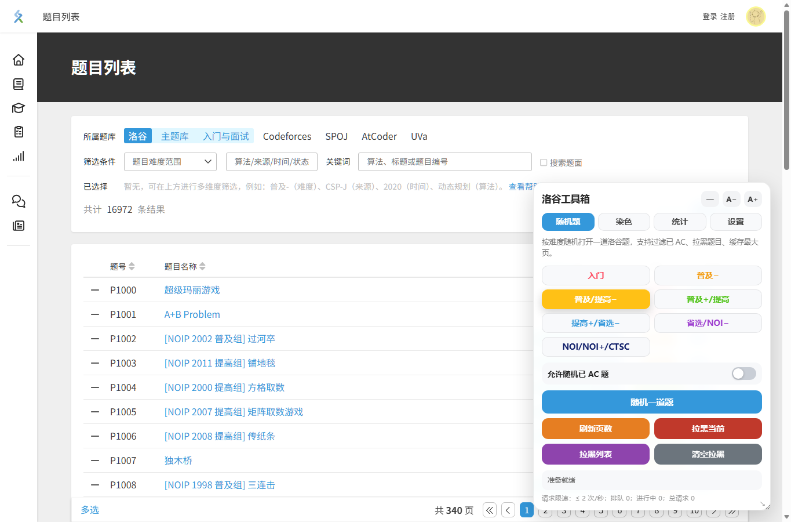
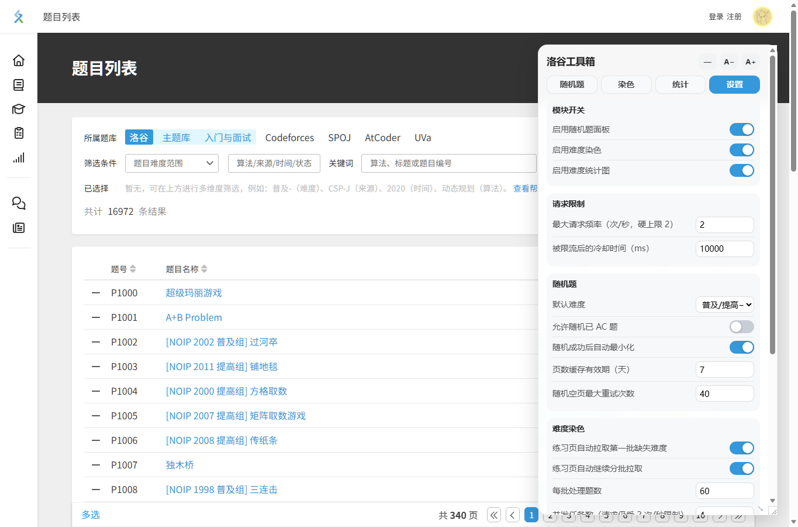

# tampermonkey

个人 Tampermonkey 脚本仓库。

## 洛谷工具箱

洛谷工具箱是一个面向 `https://www.luogu.com.cn/*` 的浏览器用户脚本，整合了随机题、题目难度染色和练习记录难度统计三个常用能力。

### 安装

安装 Tampermonkey 或 Violentmonkey 后，打开脚本文件即可安装：

```text
https://raw.githubusercontent.com/thedyingkai/tampermonkey/main/%E6%B4%9B%E8%B0%B7%E5%B7%A5%E5%85%B7%E7%AE%B1/%E6%B4%9B%E8%B0%B7%E5%B7%A5%E5%85%B7%E7%AE%B1.user.js
```

脚本适用于：

```text
https://www.luogu.com.cn/*
```

### 功能

- 随机题：按洛谷难度随机打开题目，支持跳过已 AC 题、题目拉黑、页数缓存和随机后自动最小化。
- 多难度随机：随机题可同时选中多个难度，从难度池中随机抽题。
- 按权重组题：按提前设置好的难度权重生成若干道题，可复制题号用于题单或个人邀请赛。
- 难度染色：在练习、题单、比赛等页面补全题目难度信息，并按洛谷难度颜色显示。
- 难度统计：统计练习记录中的题目难度分布，并可替换首页相关展示区域。
- 统一设置：在浮动面板中集中管理模块开关、请求频率、随机题、染色和统计参数。
- 请求限速：脚本内所有 fetch 请求统一排队，默认最多 2 次/秒，降低触发洛谷限流的概率。

### 使用

安装后打开任意洛谷页面，右下角会出现“洛谷工具箱”浮动面板。

- 在“随机题”页选择难度后点击随机按钮。
- 在“随机题”页可多选难度，随机按钮会从选中的难度池中抽题。
- 在“按权重组题”区域设置总题数和各难度权重，生成题号列表后复制到题单或个人邀请赛。
- 在题目详情页可将当前题目加入拉黑列表。
- 在“设置”页可开启或关闭随机题、难度染色、难度统计模块。
- 在练习记录相关页面可查看难度统计图表。

### 推荐配置

- 保持请求频率不高于默认的 `2 次/秒`，如果遇到洛谷限流，可以把冷却时间调大。
- 练习页题目较多时，建议保留“分批拉取”开启，让脚本逐批补全难度。
- 如果只想使用随机题，可以在设置中关闭“难度染色”和“难度统计图”，减少页面改动和请求量。
- 随机题页数缓存默认保留 7 天；洛谷题库变化频繁时，可手动刷新当前难度页数。

### 常见问题

- 面板没有出现：确认脚本管理器已启用脚本，并刷新 `https://www.luogu.com.cn/*` 页面。
- 难度没有立即染色：脚本会排队请求并受全局限速控制，题目较多时需要等待一会儿。
- 随机题一直失败：可能当前难度的可选题都已 AC 或被拉黑，可开启“允许随机已 AC 题”、清空拉黑列表，或刷新页数缓存。
- 自动更新：脚本内置 `@updateURL`，脚本管理器会按自身策略检查更新；也可以重新打开安装链接手动更新。

### 页面验证

已在洛谷题目列表页验证脚本可正常注入并显示工具箱面板：

```text
https://www.luogu.com.cn/problem/list
```

随机题面板：



设置面板：



### 本地数据

脚本设置、UI 位置、随机题页数缓存、拉黑列表、难度缓存和统计参数保存在浏览器 `localStorage` 中。清理浏览器站点数据会同时清除这些配置。

### 文件

```text
洛谷工具箱/洛谷工具箱.user.js
```
